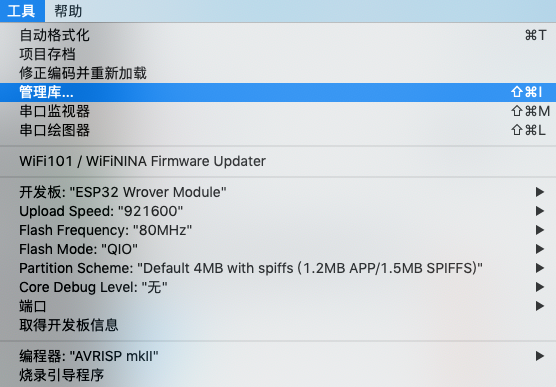
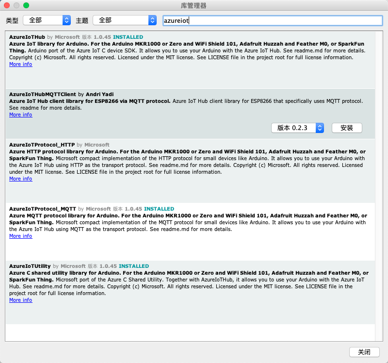
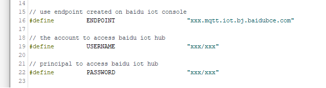

## 硬件介绍

ESP8266是乐鑫公司推出的WIFI SOC芯片，该芯片被应用在很多物联网领域。

百度云IoT平台针对ESP8266芯片做了对应的适配，包括ESP8266的Android配网程序，以及通过Arduino链接百度云的样例。

EspWifiConfig-Android是使用Android Studio开发的配网程序样例。
参考： https://github.com/EspressifApp/EsptouchForAndroid

arduino-sample是使用Arduino IDE开发的ESP8266连接百度云Hub的例子。

## 快速开始

### 软硬件环境搭建

关于esp8266 nodeMCU arduino开发环境的搭建，网络上有很多资源可以参考，这里不再赘述。

### 下载依赖

双击`esp8266/esp8266.ino`，打开Arduino工程。点击 **工具** > **管理库** > 

搜索栏中输入“azure”，安装`AzureIoTHub` `AzureIotProtocol_MQTT` `AzureIotUtility`三款插件。

之后就可以编译烧写了。

### 申请物接入资源

参考官方文档：https://cloud.baidu.com/doc/IOT/index.html，我们这里的例子中，使用了`数据型`设备，将申请到的连接信息填写入`simplesample_mqtt.c`中：

### 修改wifi用户名密码

修改文件`iot_configs.h`即可。

## 测试运行
模块默认订阅了`msgA` `msgB` 这两个主题，您可以用`MQTT fx`软件向该主题发布消息。模块收到消息后，会向`ackTopic`这个主题反馈一条消息。您可以订阅它从而监听设备的状态。